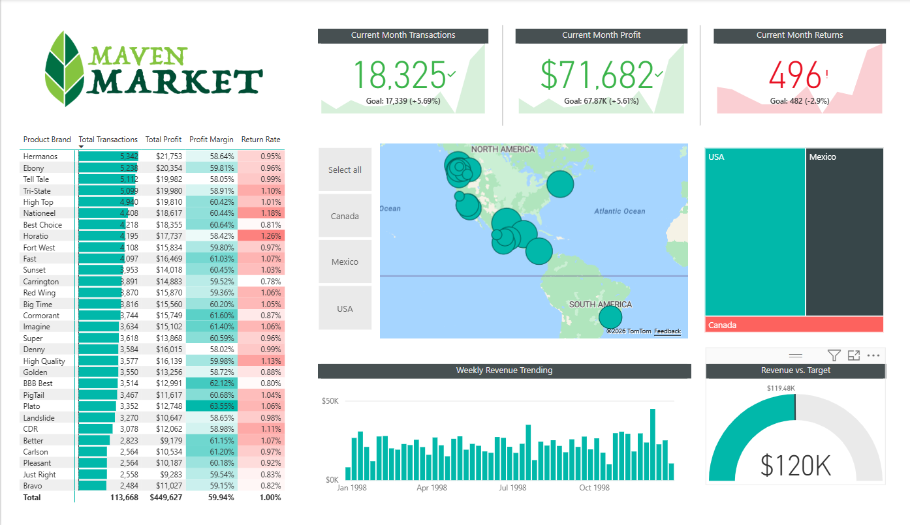

# Maven Market Retail Analytics — Power BI Dashboard

## About This Project

This is an end-to-end Power BI project I built to analyze 999,000+ retail transactions for Maven Market, a grocery chain operating across the USA, Canada, and Mexico from 1997–1998. The goal was to practice the full BI workflow — data cleaning in Power Query, data modeling, writing DAX measures, and building an interactive dashboard.

## Dashboard Preview

## Key Metrics (Dec 1998)

| Metric | Value |
|--------|-------|
| Current Month Transactions | 18,325 (+5.69% vs goal) |
| Current Month Profit | $71,682 (+5.61% vs goal) |
| Current Month Returns | 496 |
| Total Transactions | 113,668 |
| Total Profit | $449,627 |
| Profit Margin | 59.94% |
| Revenue vs Target | $120K vs $119.48K target |
| Top Brand | Hermanos (5,342 transactions) |
| Highest Margin Brand | Plato (63.55%) |

## Tools Used

- Power BI Desktop
- Power Query (ETL & data transformation)
- DAX (calculated measures)
- Star schema data modeling

## What I Did

- End-to-end ETL pipeline in Power Query — connected to a folder source to auto-combine 1997 & 1998 transaction files, standardized data types, created calculated columns, and built a clean date table
- Star schema data model with 2 fact tables (Transactions, Returns) and 6 dimension tables (Customers, Products, Stores, Regions, Calendar) — optimized for fast DAX calculations
- 15+ DAX measures including Total Revenue, Total Profit, Profit Margin %, Return Rate, Weekend Transactions, YTD Revenue, and Revenue vs Target — enabling dynamic KPI tracking
- Executive dashboard with KPI cards, map visual (USA/Canada/Mexico), weekly revenue trend chart, and a gauge chart tracking performance vs monthly targets
- Identified key insights — Hermanos led with 5,342 transactions, Plato brand achieved the highest margin at 63.55%, and Dec 1998 revenue exceeded target by 5.69%

## Files in This Repo

- Maven_Market_Report_COMPLETE.pbix — main Power BI report
- MavenMarket_Transactions_1997.csv
- MavenMarket_Transactions_1998.csv
- MavenMarket_Customers.csv
- MavenMarket_Products.csv
- MavenMarket_Stores.csv
- MavenMarket_Regions.csv
- MavenMarket_Calendar.csv
- MavenMarket_Returns_1997-1998.csv

## How to Open

1. Download the .pbix file
2. Open in Power BI Desktop (free)
3. Update the data source path to your local CSV folder if needed
4. Click Refresh

## Author

Manoj Sai Kumar Pedarla

MS in Data Engineering, University of North Texas

www.linkedin.com/in/manojpedarla
